# Week 2 Lab Report
## Remote Access for Mac OS

***

### **Installing VS Code**

Go to [VS Code's website](https://code.visualstudio.com/) and click `download`.

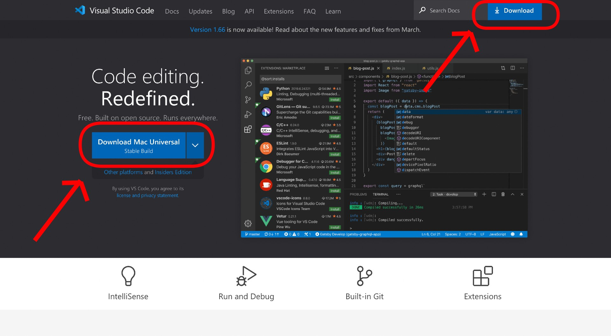

Extract the downloaded `.zip` file and move the application to `/Applications/`.

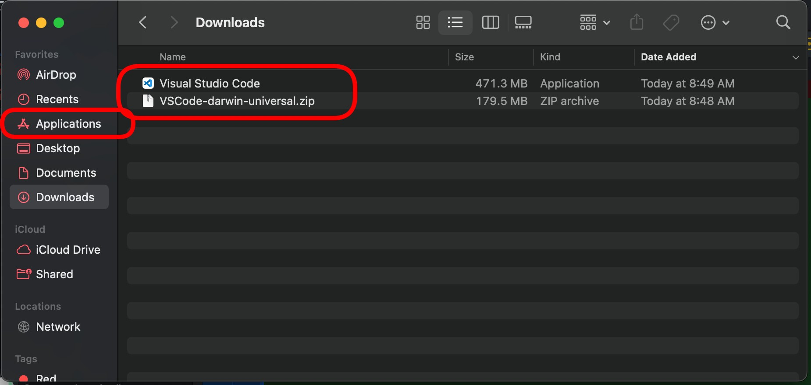

Open the application and you should be able to start working!

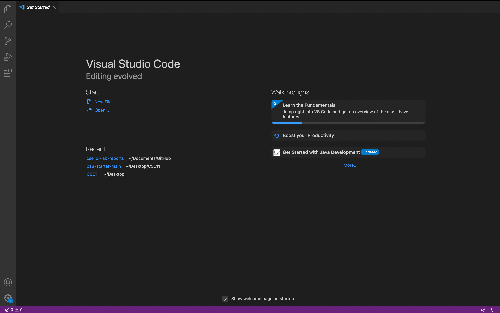

***

### **Remotely Connecting**

Use UCSD's [Account Lookup tool](https://sdacs.ucsd.edu/~icc/index.php) to find your CSE15L remote access login information.

Your username should be of the form `cs15lsp22`, followed by three letters. Make sure to set/find your password.

Open a new terminal by navigating `Terminal` &rarr; `New Terminal`.

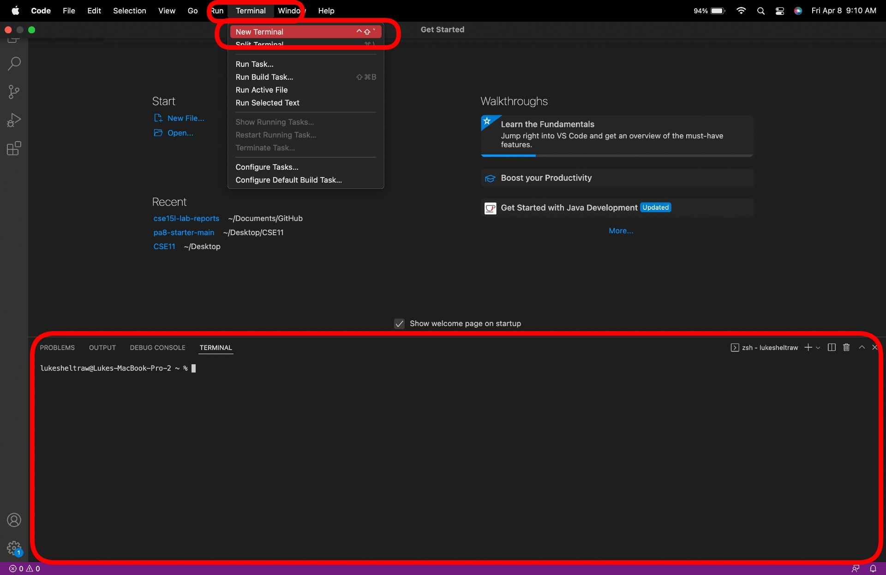

Enter the command `$ ssh cs15lsp22[   ]@ieng6.ucsd.edu` (where the blank is filled in with your username's specific letters) into the terminal. Continue if asked, and then enter your password when prompted.

You are now successfully remotely logged in!

***

### **Trying Out Commands**

There are plenty of commands you can try to run from your terminal. Here are some examples:
- `cd <destination>` (move from one directory to another)
- `ls <destination>` (list the contents of a directory, or the current directory if not specified)
- `pwd` (print the absolute path of the current working directory)
- `cp <source> <destination>` (copy a file)
- `cat <source>` (print out the contents of a file)
- `mv <source> <destination>` (move a file)
- `mv <source> <new name>` (rename a file)
- `mkdir <name>` (create a new directory)

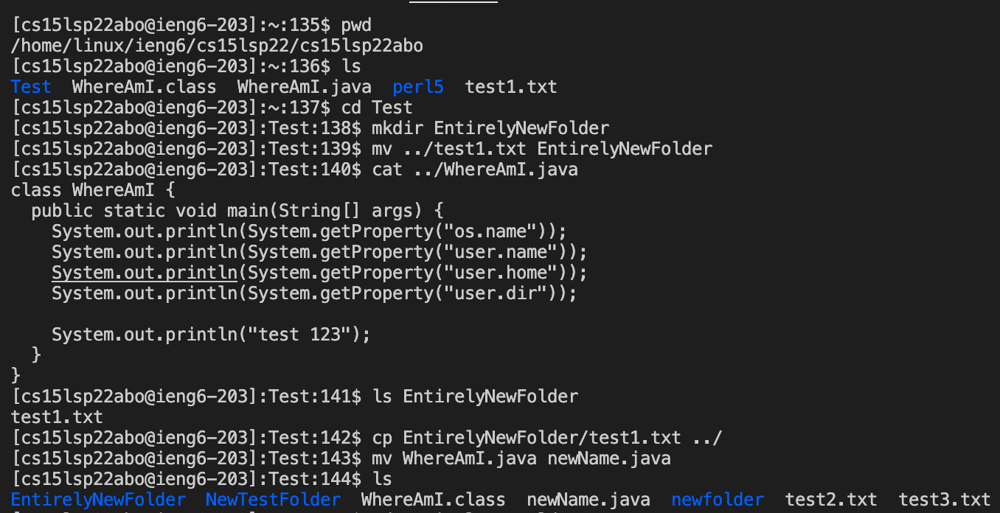

**Remember**: When logged in remotely, commands run from the remote server instead of your local client.

**Remember**: You can use modifiers like `ls -a` or `ls -l` to modify the behavior of commands, or `ls -la` to do both at the same time.

***

### **Moving Files with `scp`**

Inevitably, you will need to move files from your local client to the remote server. To do this, you use the command `scp`. The syntax is as follows, and is run from your local client:

`scp <source> <destination>`

In practice, this may look like

`scp TestFile.txt cs15lsp22abc@ieng6.ucsd.edu:~/`

If prompted, enter your password.

**Remember**: For the destination of the file, in this case, `cs15lsp22abc@ieng6.ucsd` designates the remote account we are accessing, while `:~/` designates that we are transfering the file to the home directory. 

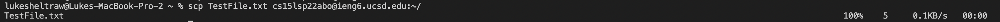

After successfully running the command, you should be met with a readout displaying the name of the transferred file, and statistics on its transfer.

***

### **Setting an SSH Key**

SSH keys allow you to skip the step of having to enter your password every time you use `ssh` or `scp` commands. To set up your keys, do as follows:

1. On the local client, run the command `ssh-keygen` to generate your public and private keys. When prompted to enter a file or passphrase, simply click `return`.

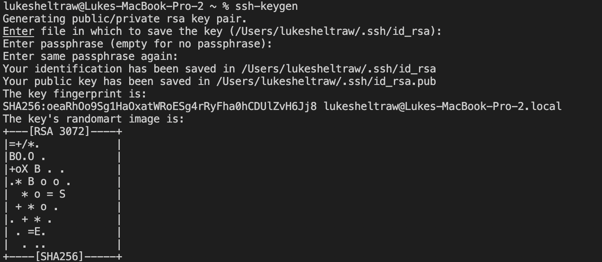

2. `ssh` into the remote server and run the command `mkdir .ssh` to create a new directory. Then exit.

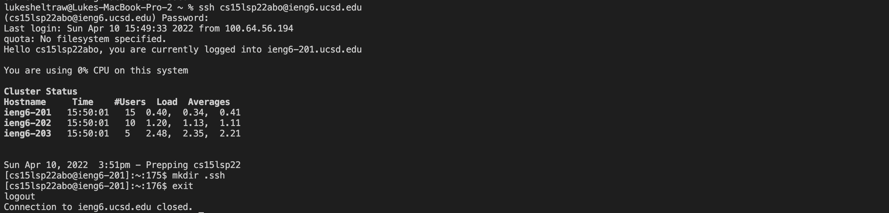

3. From your local client again, run the command `scp /Users/<username>/.ssh/id_rsa.pub cs15lsp22abc@ieng6.ucsd.edu:~/.ssh/authorized_keys` to copy the public key to the remote server. Your `<username>` is the username on your local client, i.e. `/Users/lukesheltraw/`. Remember to replace `abc` with your remote server's three letters.

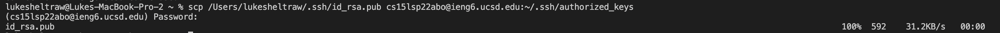

Try running `scp` and `ssh` now. You shouldn't need to enter a password!

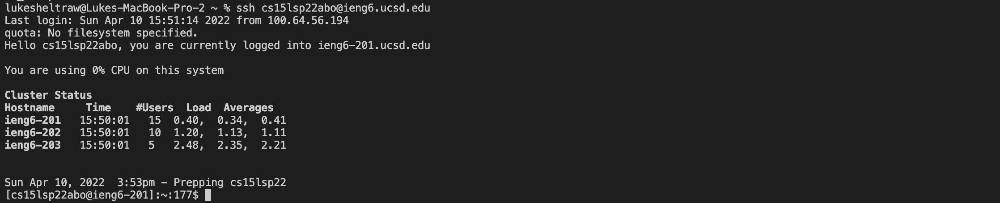

***

### **Optimizing Remote Running**

A very common use case of a remote server is copying a file from your local client to the remote server, compiling it, and then running it. In general, when there exists a series of commands that are run often, it can be useful to find faster ways to enter them.

Here are a few principles we can use to do so:
- Distinct commands can be combined onto a single line by separating them with semicolons (`;`).
- Single commands can be run from the remote server following the format `ssh <server> <command>`.
- Multiple arguments / commands can be connected with quotes (`""`).

For instance, to transfer a Java file to the remote server, compile it, and then run it, we might use a single command that looks like this:

`scp Example.java cs15lsp22abc@ieng6.ucsd.edu:~/ ; ssh cs15lsp22abc@ieng6.ucsd.edu "javac Example.java ; java Example"`

**Remember**: You can use the up and down keys to locate previouly used commands quickly. 

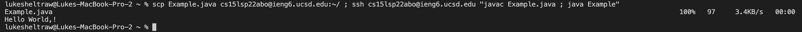

This is what such a command would look like running a Java file that prints out the phrase "Hello, World!". Note that this file is run from the remote server, *not* the local client.

