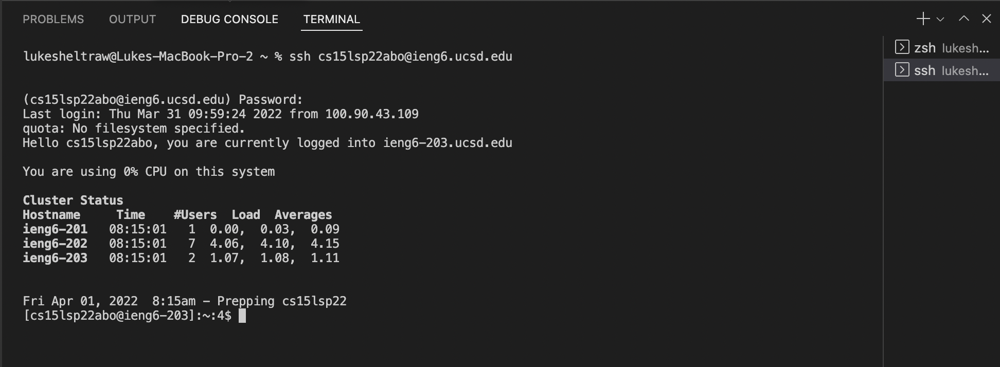

# Week 2 Lab Report
## Remote Access for Mac OS

***

### **Installing VS Code**

Go to [VS Code's website](https://code.visualstudio.com/) and click `download`.

Extract the download `.zip` file and move the application to `/Applications/`.

Open the application and you should be able to start working!

### **Remotely Connecting**

Use UCSD's [Account Lookup tool](https://sdacs.ucsd.edu/~icc/index.php) to find your CSE15L remote access login information.

Your username should be of the form `cs15lsp22`, followed by three letters. Make sure to set/find your password.

Open a new terminal by navigating `Terminal` &rarr; `New Terminal`.

Enter the command `$ ssh cs15lsp22[   ]@ieng6.ucsd.edu` (where the blank is filled in with your username's specific letters) into the terminal. Continue if asked, and then enter your password when prompted.

You are now successfully remotely logged in!

### **Trying Out Commands**

There are plenty of commands you can try to run from your terminal. Here are some examples:
- `cd <destination>` (move from one directory to another)
- `ls <destination>` (list the contents of a directory, or the current directory if not specified)
- `pwd` (print the absolute path of the current working directory)
- `cp <source> <destination>` (copy a file)
- `cat <source>` (print out the contents of a file)
- `mv <source> <destination>` (move a file)
- `mv <source> <new name>` (rename a file)
- `mkdir <name>` (create a new directory)

**Remember**: when logged in remotely, commands run from the remote server instead of your local client.

### **Moving Files with `scp`**

### **Setting an SSH Key**

### **Optimizing Remote Running**

