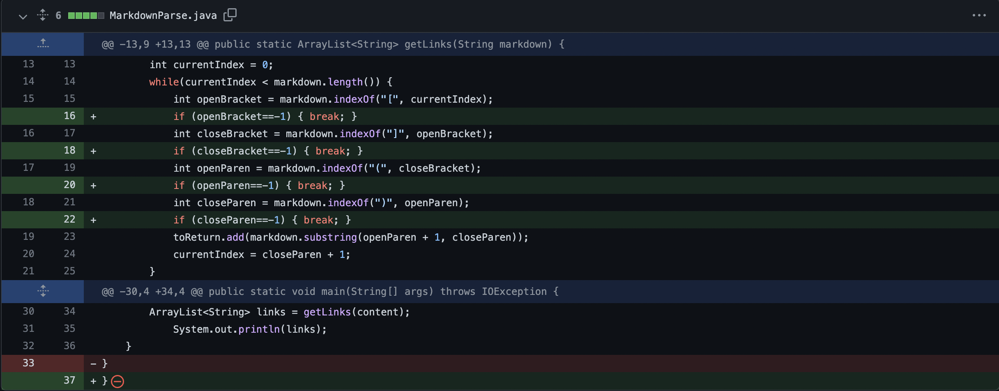
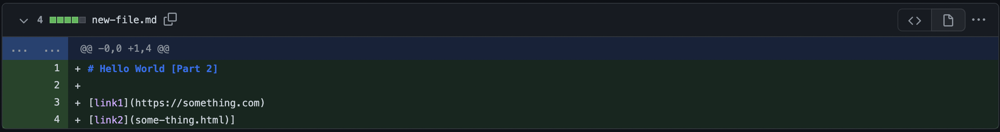
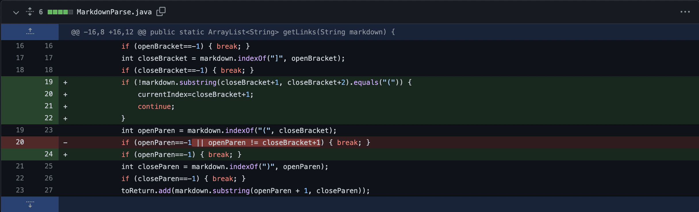
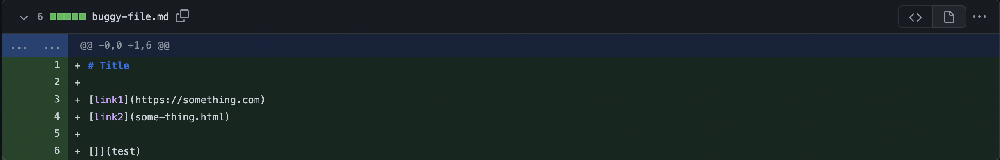
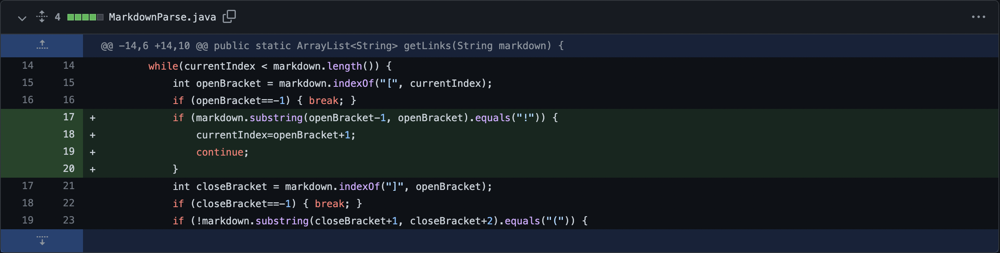
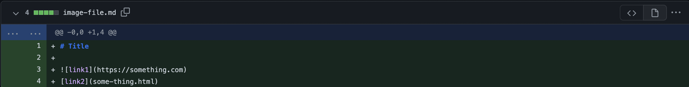

# Lab Report 2 - _Week 4_
## Debugging

***

### **Code Change 1**

**Accounting for non-link text at the end of input file.**

*Change to file on [GitHub](https://github.com/Luke-Sheltraw/markdown-parser/commit/113da7e36253465dcd9df5ce7825d539a508e8b1)*:
[](https://github.com/Luke-Sheltraw/markdown-parser/commit/113da7e36253465dcd9df5ce7825d539a508e8b1)

*Failure-inducing input on [GitHub](https://github.com/Luke-Sheltraw/markdown-parser/commit/c0ec2021c551959d066001ce0e3a9c412b2c6604)*:
[](https://github.com/Luke-Sheltraw/markdown-parser/commit/c0ec2021c551959d066001ce0e3a9c412b2c6604)

*Symptom*:
```
Exception in thread "main" java.lang.OutOfMemoryError: Java heap space
        at java.base/java.lang.StringLatin1.newString(StringLatin1.java:769)
        at java.base/java.lang.String.substring(String.java:2709)
        at MarkdownParse.getLinks(MarkdownParse.java:19)
        at MarkdownParse.main(MarkdownParse.java:30)
```
*Expected output*:
```
[https://something.com, some-thing.html]
```

*Description*:

The bug here is that the code assumed that the final text in the file would be a link. Thus, when such was not the case in our failure-inducing input file (i.e. the single closing bracket at the very end of the file), the code showed the symptom of an OutOfMemoryError, or an infinite loop. This makes sense, as .indexOf() returns -1 for a String that is not found, and the loop sets the currentIndex to be 1 greater than the index of the most recent closing parenthesis—resulting in a currentIndex of 0 whenever it can't find a closing parenthesis. The while-loop runs until currentIndex is equal to or greater than the length of the text, meaning it runs forever if there is text that isn't a link at the end of the file. We fixed this by breaking the while-loop if it can't find all the components necessary for a link in the correct order.  

***

### **Code Change 2**

**Accounting for text between brackets and parentheses.**

*Change to file on [GitHub](https://github.com/Luke-Sheltraw/markdown-parser/commit/ad8fcfd5840604823b8f7cb3226134e04b6d717a)*:
[](https://github.com/Luke-Sheltraw/markdown-parser/commit/ad8fcfd5840604823b8f7cb3226134e04b6d717a)

*Failure-inducing input on [GitHub](https://github.com/Luke-Sheltraw/markdown-parser/commit/5c6788e3d730249f551e486c65ba7791108f6565)*:
[](https://github.com/Luke-Sheltraw/markdown-parser/commit/5c6788e3d730249f551e486c65ba7791108f6565)

*Symptom*:
```
[https://something.com, some-thing.html, test]
```
*Expected output*:
```
[https://something.com, some-thing.html]
```

*Description*:

The bug here is that the code assumed that any pair of parentheses after a pair of brackets contained a link, which is true if the parentheses directly follow—but not if they are separated by text. The failure-inducing input file contained such a situation, in which the brackets and parentheses were broken by text. This should have resulted in that link being interpreted as plain text, but resulted in the symptom of an incorrect output (i.e. the output list contained the text, "test", contained in the parentheses). The fix was to jump to the next set of closed brackets if the ones being looked at were not directly followed by an opening parenthesis.  

***

### **Code Change 3**

**Accounting for images.**

*Change to file on [GitHub](https://github.com/Luke-Sheltraw/markdown-parser/commit/6ce796af56d433444961c945c51b3b59216f299e)*:
[](https://github.com/Luke-Sheltraw/markdown-parser/commit/6ce796af56d433444961c945c51b3b59216f299e)

*Failure-inducing input on [GitHub](https://github.com/Luke-Sheltraw/markdown-parser/commit/c632abb0bb92bba407beb855cd33a3590394764b)*:
[](https://github.com/Luke-Sheltraw/markdown-parser/commit/c632abb0bb92bba407beb855cd33a3590394764b)

*Symptom*:
```
[https://something.com, some-thing.html]
```
*Expected output*:
```
[some-thing.html]
```

*Description*:

The bug here is that the code had no way to account for images included in the input files. In markdown, an image is denoted the exact same way as a link, but with an exclamation mark (!) as the character directly before. The failure-inducing file included such an image, and resulted in the symptom of an incorrect output (i.e. the path to the image was included in the output list, when it shouldn't have been). The fix was to skip over any set of brackets directly after an exclamation mark. 