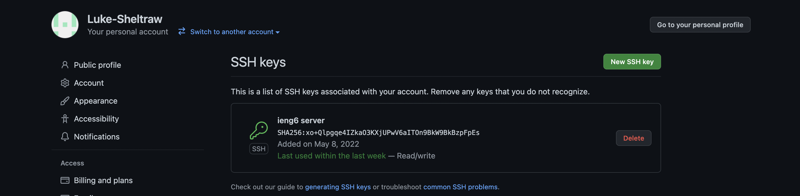
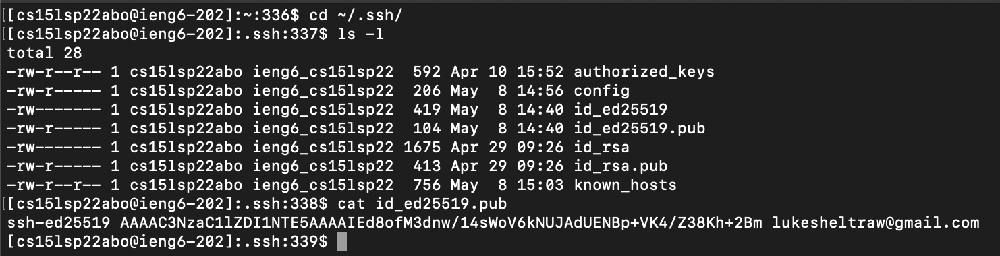
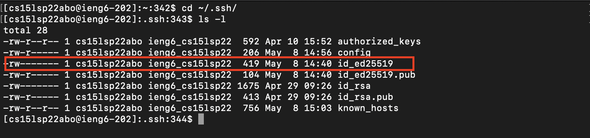
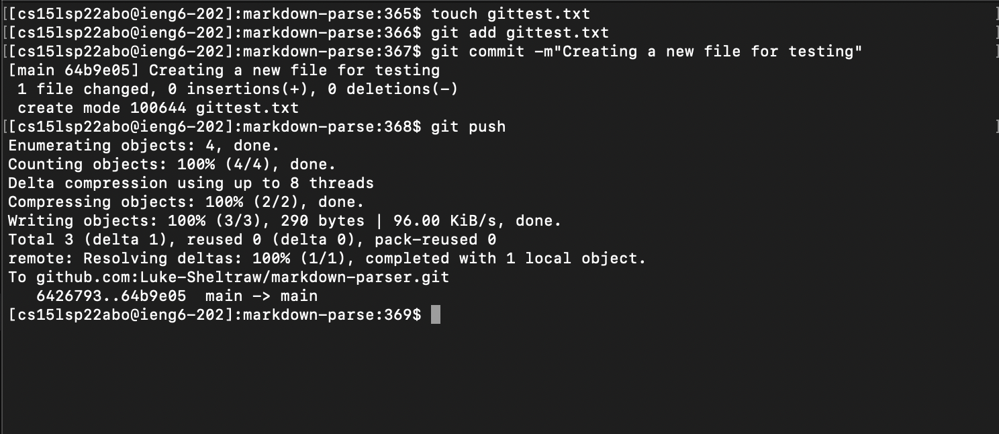
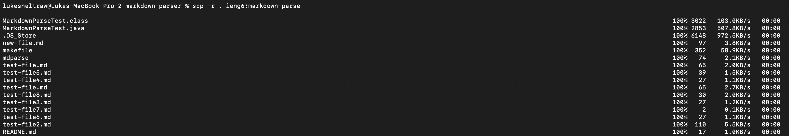
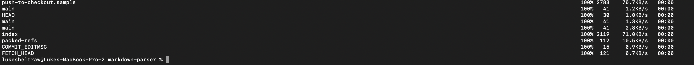
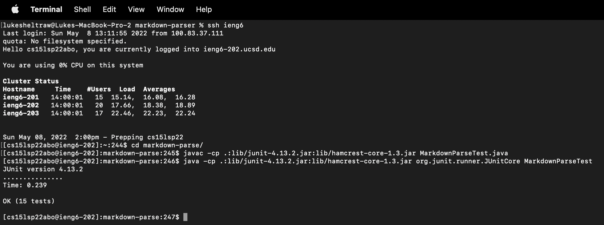
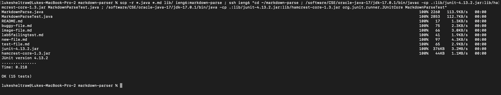

# Lab Report 3 - _Week 6_
## Group Choices 1–3

***

### **Choice 1**

**Streamlining `ssh` configuration.**

*Editing `~/.ssh/config` with VS Code*:


*Using `ssh` to log in with the new alias*:


*Using `scp` to transfer files with the new alias*:


*Description*: 

By editing the `ssh` config file, `~/.ssh/config`, I was able to assign `ieng6` as an alias for my full remote account name, `cs15lsp22abo@ieng6.ucsd`. This then allows me to save time and effort by logging in to the remote server using just `ssh ieng6`. Furthermore, I am able to use the alias anywhere else I would be using the full account name: such as to transfer files with `scp`.

***

### **Choice 2**

**Setting up Github access from `ieng6`.**

*Public key's location on GitHub and on my user account*:



*Private key's location on my user account:*


*Running git commands to commit and push a change to Github, remotely logged in*:


*Link for the resulting commit*: [https://github.com/Luke-Sheltraw/markdown-parser/commit/64b9e0555548afe667cded2d957ef44203fd41ab](https://github.com/Luke-Sheltraw/markdown-parser/commit/64b9e0555548afe667cded2d957ef44203fd41ab)


*Description*: 

Normally, I commit and push changes using GitHub Desktop. Obviously, that is not an option when remotely logged into `ieng6`. In order to do so from the terminal, I created a public and private key pair. The private key stays private, and the public key is uploaded to my GitHub account. This then allows me to `git push` without a password!

***

### **Choice 3**

**Copying whole directories with `scp -r`.**

*Copying my `/markdown-parse/` directory to `ieng6`*:


*(Split across two images, as the print-out is very long)*

*Logging into `ieng6` and compiling/running the tests for my repo*:


*Combining `scp`, `;`, and `ssh` to copy entire directory and run tests in a single line*:


*Description*:

Normally, `scp` allows us to just copy a single file. However, by using the `-r` flag, we are able to recursively copy entire directories (and their subdirectories) to the remote server. The following command allows me to copy only the files I need (`.java` files, `.md` files, and the `lib/` directory) to the remote server, and then compile and run all the test cases in `MarkdownParseTest.java`. All in one line.
> ```scp -r *.java *.md lib/ ieng6:markdown-parse ; ssh ieng6 "cd ~/markdown-parse ; /software/CSE/oracle-java-17/jdk-17.0.1/bin/javac -cp .:lib/junit-4.13.2.jar:lib/hamcrest-core-1.3.jar MarkdownParseTest.java ; /software/CSE/oracle-java-17/jdk-17.0.1/bin/java -cp .:lib/junit-4.13.2.jar:lib/hamcrest-core-1.3.jar org.junit.runner.JUnitCore MarkdownParseTest"```