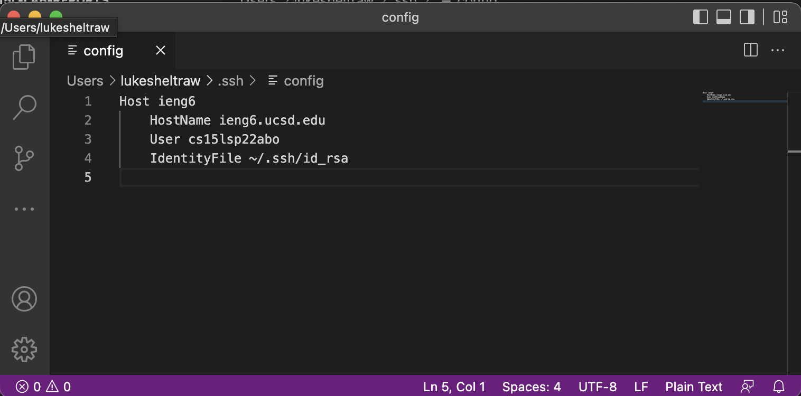
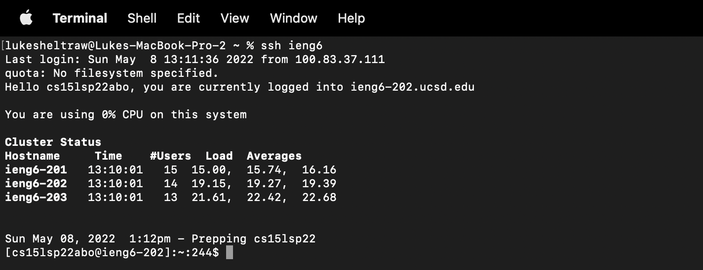
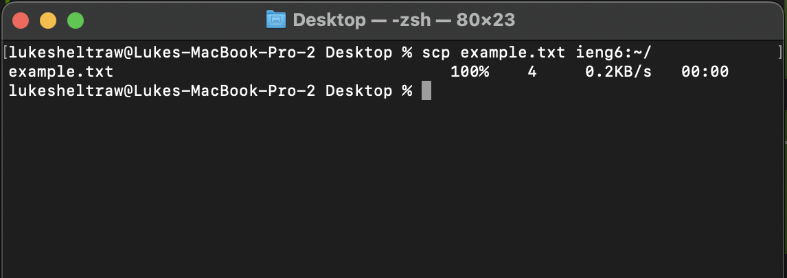

# Lab Report 3 - _Week 6_
## Group Choices 1–3

***

### **Streamlining ssh Configuration**

*Editing `.ssh/config` to be able to use `ieng6` instead of the full hostname of my remote account, `cs15lsp22abo@ieng6.ucsd.edu`. I used VS Code to edit the file.*

*Using `ssh` to log in; now I don't have to type out the full account name!*

*Using `scp` to transfer files with the new shorthand.*

***

### **Setup Github Access from ieng6**

***

### **Copy whole directories with scp -r**

***