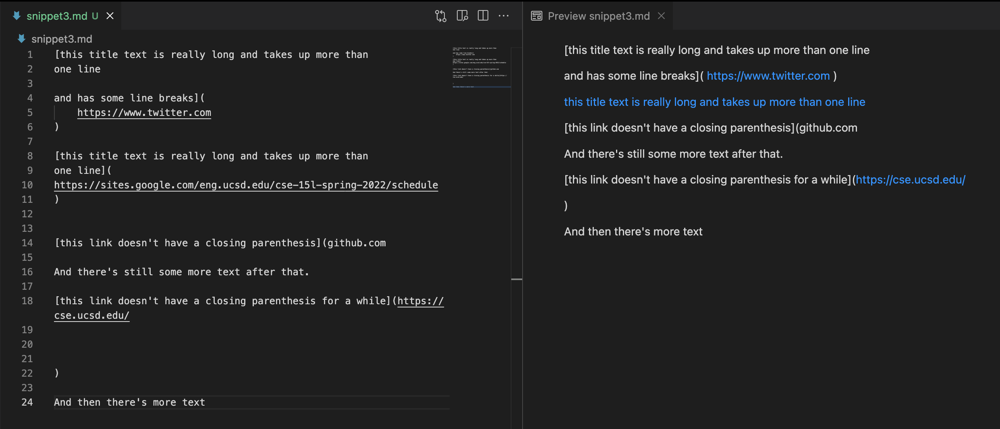

# Lab Report 4 - _Week 8_
## Markdown Parser Test Snippets

***

**`markdown-parse` repository links**:

*My repository*: [https://github.com/Luke-Sheltraw/markdown-parser](https://github.com/Luke-Sheltraw/markdown-parser)

*Reviewed repository*: [https://github.com/mrreganwang/markdown-parser](https://github.com/mrreganwang/markdown-parser)

***

### **Snippet 1**

*Expected output*:

**Description**: VSCode's Preview shows that there are three links, which would form the list ``[`google.com, google.com, ucsd.edu]``.

*Tests in `MarkdownParseTest.java`*:

*Tests on my implementation*:

**Description**: 

*Tests on reviewed implementation*:

**Description**: 

***

### **Snippet 2**

*Expected output*:

**Description**: VSCode's Preview shows that there are three links, which would form the list ``[a.com, a.com(()), example.com]``.

*Tests in `MarkdownParseTest.java`*:

*Tests on my implementation*:

**Description**: 

*Tests on reviewed implementation*:

**Description**: 

***

### **Snippet 3**

*Expected output*:

**Description**: VSCode's Preview shows that there is one link, which would form the list ``[https://sites.google.com/eng.ucsd.edu/cse-15l-spring-2022/schedule]``. There are two other "links," however that is because VSCode automatically interprets anything of the form https://... as a link (as illustrated by them having no title). In the scope of this project, then, we would not consider those two to be expected output. 

*Tests in `MarkdownParseTest.java`*:

*Tests on my implementation*:

**Description**: 

*Tests on reviewed implementation*:

**Description**: 

***

### **Questions**

**Question 1**: Do you think there is a small (<10 lines) code change that will make your program work for snippet 1 and all related cases that use inline code with backticks? If yes, describe the code change. If not, describe why it would be a more involved change.

**Answer**:

***

**Question 2**: Do you think there is a small (<10 lines) code change that will make your program work for snippet 2 and all related cases that nest parentheses, brackets, and escaped brackets? If yes, describe the code change. If not, describe why it would be a more involved change.

**Answer**:

***

**Question 3**: Do you think there is a small (<10 lines) code change that will make your program work for snippet 3 and all related cases that have newlines in brackets and parentheses? If yes, describe the code change. If not, describe why it would be a more involved change.

**Answer**:

***

**Explanation of passed tests**: