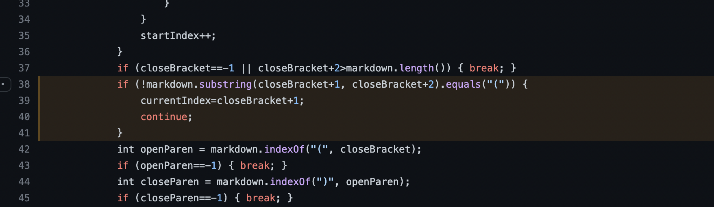

# Lab Report 5 - _Week 10_
## Markdown Parser: Different Implementations

***

**How I found differing tests**:
To find differing tests, I used a bash for-loop to iterate through and test every `.md` file in the `test-files/` folder, passing each file as an argument to `MarkdownParse`. This code was provided in Lab 9's [`script.sh`](https://github.com/nidhidhamnani/markdown-parser/blob/main/script.sh). I passed all these results to two text files (one for my implementation, one for the provided), and then used `vimdiff` to compare the results of the two files. From this, I was able to easily pinpoint differing outputs (pictured below). I chose two test-files from the list of differences which were representative of distinct bugs: `test-files/194.md` and `test-files/489/md`.


***

**Test 1: [`test-files/194.md`](https://github.com/nidhidhamnani/markdown-parser/blob/main/test-files/194.md)**

*`test-files/194.md` on GitHub*: [https://github.com/nidhidhamnani/markdown-parser/blob/main/test-files/194.md](https://github.com/nidhidhamnani/markdown-parser/blob/main/test-files/194.md)
```
[Foo*bar\]]:my_(url) 'title (with parens)'

[Foo*bar\]]
```

*Actual outputs*:

(Provided implementation: `[url]`)


(My implementation: `[]`)

*Expected output*: `[my_(url)]`


*Correct implementation*: Neither implementation was correct, although the provided implementation was arguably "more" correct, as it provided a link—albeit an incorrect one.

*Description of bug*:

The issue is the same in both implementations, but I will explain it in the context of mine. Markdown has the standard link formatting that we have handled up until this point (i.e. `[name](url)`), but it _also_ has something called reference links (described [here](https://riptutorial.com/markdown/example/2215/reference-link)); these references links are essentially variable definitions for URLs. Our program has no handling of these reference links, and thus—in my code—lines 38 through 41 simply see that the opening parenthesis is separated from the closing bracket and ignores it as a link. A change needs to be made here to check for reference-style definitions, and send those through a different path of checks than normal links (we would also have to check where they are used, not just that their definition is valid).

***

**Test 2: [`test-files/489.md`](https://github.com/nidhidhamnani/markdown-parser/blob/main/test-files/489.md)**

*`test-files/489.md` on GitHub*: [https://github.com/nidhidhamnani/markdown-parser/blob/main/test-files/489.md](https://github.com/nidhidhamnani/markdown-parser/blob/main/test-files/489.md)
```
[link](foo
bar)
```

*Actual outputs*:

(Provided implementation: `[]`)


(My implementation: `[foo\nbar]`)

*Expected output*: `[]`


*Correct implementation*: The provided implementation was correct. It correctly provided an empty list, indicating that no link was present.

*Description of bug*:

The bug in my implementation occured because my implementation has no handling for links broken across multiple lines. A correct implementation should void a link if it is broken across multiple lines (unless it is just the parentheses on new lines). Specifically, line 44 of my `MarkdownParse.java` illustrates this issue: the closing parenthesis is defined to simply be the next closing parenthesis in the input, disregarding any line breaks. More case-checking should be added here instead.