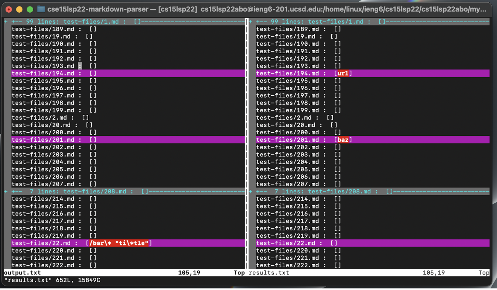
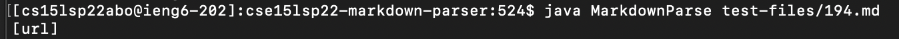
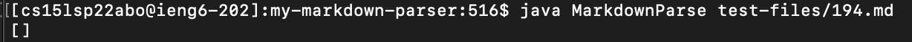
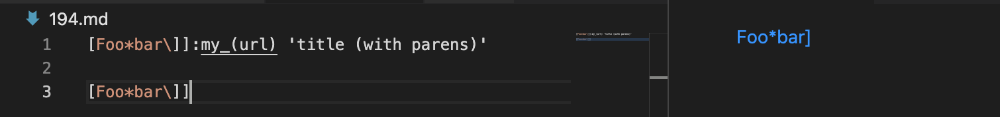
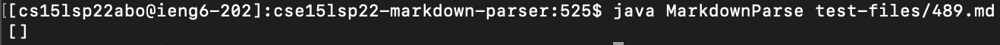
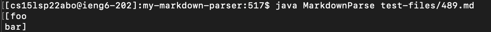
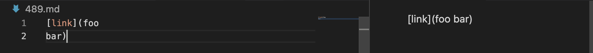

# Lab Report 5 - _Week 10_
## Markdown Parser: Different Implementations

***

**How I found differing tests**:
To find differing tests, I used a bash for-loop to iterate through and test every `.md` file in the `test-files/` folder, passing each file as an argument to `MarkdownParse`. This code was provided in Lab 9's [`script.sh`](https://github.com/nidhidhamnani/markdown-parser/blob/main/script.sh). I passed all these results to two text files (one for my implementation, one for the provided), and then used `vimdiff` to compare the results of the two files. From this, I was able to easily pinpoint differing outputs (pictured below). I chose two test-files from the list of differences which were representative of distinct bugs: `test-files/194.md` and `test-files/489/md`.


***

**Test 1: [`test-files/194.md`](https://github.com/nidhidhamnani/markdown-parser/blob/main/test-files/194.md)**

*`test-files/194.md` on GitHub*: [https://github.com/nidhidhamnani/markdown-parser/blob/main/test-files/194.md](https://github.com/nidhidhamnani/markdown-parser/blob/main/test-files/194.md)
```
[Foo*bar\]]:my_(url) 'title (with parens)'

[Foo*bar\]]
```

*Actual outputs*:

(Provided implementation: `[url]`)


(My implementation: `[]`)

*Expected output*: `[my_(url)]`


*Correct implementation*: Neither implementation was correct, although the provided implementation was arguably "more" correct, as it provided a link—albeit an incorrect one.

*Description of bug*:


***

**Test 2: [`test-files/489.md`](https://github.com/nidhidhamnani/markdown-parser/blob/main/test-files/489.md)**

*`test-files/489.md` on GitHub*: [https://github.com/nidhidhamnani/markdown-parser/blob/main/test-files/489.md](https://github.com/nidhidhamnani/markdown-parser/blob/main/test-files/489.md)
```
[link](foo
bar)
```

*Actual outputs*:

(Provided implementation: `[]`)


(My implementation: `[foo\nbar]`)

*Expected output*: `[]`


*Correct implementation*: The provided implementation was correct. It correctly provided an empty list, indicating that no link was present.

*Description of bug*:
